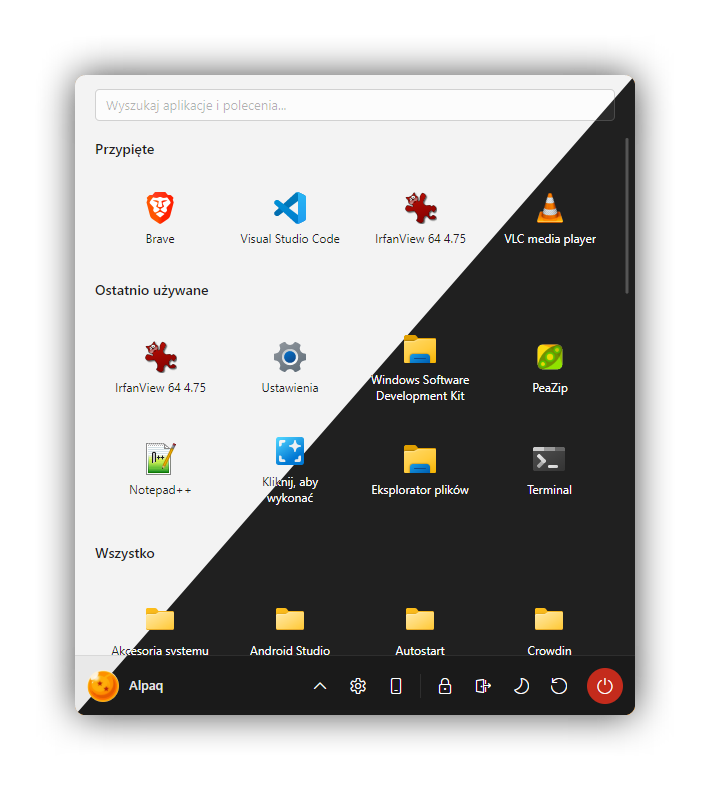

# MenYou

A Windows Start-menu replacement written in C# / Avalonia. Ships five built-in looks — Windows 11 (the default), Modern (Windows 7), Linux Mint Cinnamon, Classic XP and Classic 9x — rendered on top of modern Windows shell metadata (localized labels, account picture, taskbar pins, Start mirror, JumpLists) rather than reinventing them.

<p align="center">
  <a href="docs/SHOWCASE.md"></a>
  <br />
  <sub><a href="docs/SHOWCASE.md"><b>See every theme in light &amp; dark →</b></a></sub>
</p>

> [!TIP]
> Press **Shift+Win** to toggle the menu.

## Why?

This started with a debloated Windows 11 ([Tiny11](https://github.com/ntdevlabs/tiny11builder)). Stripping the image also strips out whatever Start-menu search uses to find local apps — apparently locating Notepad on your own PC routes through Edge. With search broken, I needed a new Start menu. [Open-Shell](https://github.com/Open-Shell/Open-Shell-Menu) was the one solid free/OSS option, but none of its skins did it for me. I tried theming it, went down the rabbit hole of how it works, and concluded I wanted something more flexible on a well-known stack. MenYou is the result: a ground-up-skinnable Start menu on **.NET 10** + **Avalonia 12**.

## Install

| Channel | Command |
|---|---|
| **GitHub Releases** | [Latest release](https://github.com/Alpaq92/MenYou/releases/latest) — download `MenYou-Setup-<version>.exe` |
| **Scoop** | `scoop bucket add menyou https://github.com/Alpaq92/scoop-menyou`<br>`scoop install menyou` |
| **winget** | _coming soon_ |
| **Chocolatey** | _coming soon_ |

The installer is built with [Inno Setup](https://jrsoftware.org/isinfo.php) — a standard setup wizard where you can override the install location, Start-Menu folder, and shortcuts (per-user by default, with a per-machine option). Updates are checked in-app against GitHub Releases: **Settings → Sprawdź aktualizacje** downloads the latest installer and runs it to upgrade in place. Code-signing status (SignPath Foundation when available, otherwise unsigned) is noted in the release body — see [`docs/AUTOMATION.md`](docs/AUTOMATION.md) for the deployment pipeline.

## Build from source

```powershell
# Requires the .NET 10 SDK. The project targets net10.0-windows.
dotnet build src/MenYou/MenYou.csproj

# Run
src/MenYou/bin/Debug/net10.0-windows/MenYou.exe
```

The native input bridge under `src/MenYou.Bridge/` is compiled by `build-bridge.ps1` as a pre-build step. It's optional — if MSVC isn't installed the script exits 0 and MenYou falls back to the managed WinEvent monitor at runtime.

Press **Shift+Win** to toggle the menu.

## Translation

MenYou is partly translated for free: every system label ("Settings", "Pinned", "Apply", "Sign out", …) pulls live from the Windows shell DLLs, so it reads in your locale automatically. The MenYou-specific strings ("Mirror Windows Start pins", the update-check statuses, etc.) live in [`src/MenYou/Languages/*.json`](src/MenYou/Languages/) and need humans.

**Help out via [Crowdin](https://crowdin.com/project/menyou)**: pick your language and translate the strings that read awkwardly in the web editor. The monthly maintenance job syncs completed translations back into the repo, so they ship in the next release. Prefer git? Edit [`src/MenYou/Languages/<lang>.json`](src/MenYou/Languages/) directly and open a PR — it's merged the same way.

## Custom themes

The Settings dialog has a **Custom** tab that loads a self-contained AXAML file, parses it through `AvaloniaRuntimeXamlLoader` on every keystroke, and renders the result in a live preview pane next to the editor. Loaded files are copied into `%AppData%\MenYou\CustomThemes\` so they survive uninstalls; the **Save** button re-exports the current editor content to a path of your choice.

A worked example lives in [`samples/custom-themes/Windows7Square.axaml`](samples/custom-themes/Windows7Square.axaml) — the Modern (Windows 7) layout with every corner squared off, a compact illustration of re-skinning an existing layout by overriding its styles. Load it from Settings → Custom → Load… and edit live. See [`docs/THEMING.md`](docs/THEMING.md) for the authoring constraints (no `x:Class`, no compiled bindings, SVG paths for glyphs).

The Windows 11 and Linux Mint Cinnamon looks that used to ship as custom-theme samples are now **built-in styles** — pick them (alongside Modern (Windows 7), Classic XP and Classic 9x) from **Settings → Wygląd (Appearance)**.

## Documentation

- [`docs/OVERVIEW.md`](docs/OVERVIEW.md) — architecture, tech stack, how it works.
- [`docs/AUTOMATION.md`](docs/AUTOMATION.md) — CI/CD map, code-signing options, required secrets, and the release pipeline.
- [`docs/THEMING.md`](docs/THEMING.md) — authoring custom themes for the Settings → Custom feature.
- [`CREDITS.md`](CREDITS.md) — inspirations, third-party code, and asset attributions.
- [`CHANGELOG.md`](CHANGELOG.md) — versioned change log (auto-generated by release-please from Conventional Commits).
- [`CONTRIBUTING.md`](CONTRIBUTING.md) — building, layout, PR flow.

## License

[MIT](LICENSE) © Alpaq and MenYou contributors.

Inspirations and third-party attributions (including the app icon) are collected in [`CREDITS.md`](CREDITS.md).
