# MenYou — theme showcase

MenYou renders the same live Windows data — your pinned + recent apps, the account picture, JumpLists, localized labels — through a swappable *look*. Five styles ship built in, plus a custom-theme sample, and every one works in both light and dark.

**Click any thumbnail for the full-resolution screenshot.**

| Style | Light | Dark |
|---|:---:|:---:|
| **Windows 11** &nbsp;·&nbsp; *the default.* Search on top, a tile grid of pins + recents, account and power along the bottom bar. | [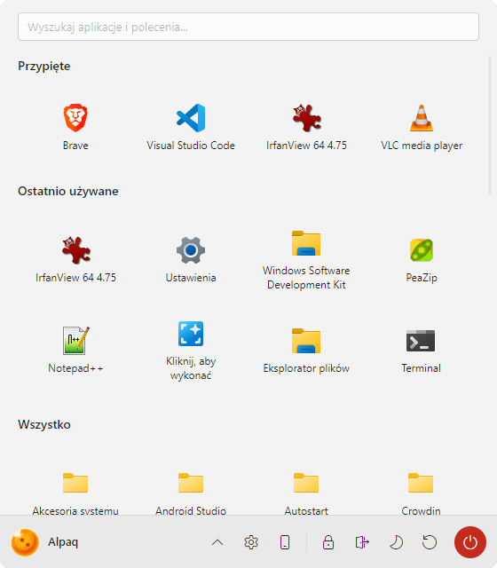](../gallery/win11-light.png) | [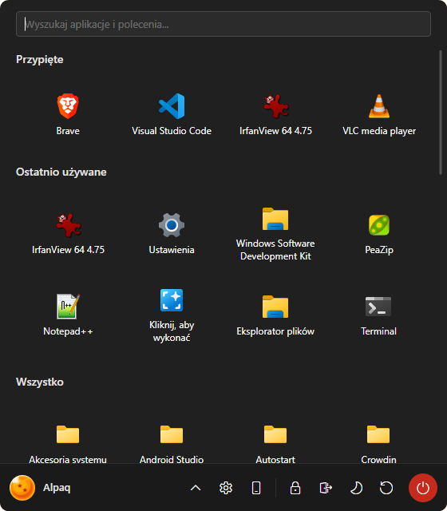](../gallery/win11-dark.png) |
| **Modern (Windows 7)** &nbsp;·&nbsp; Two columns — pinned tiles + the user header on top, an inline All Programs tree, search and the power verbs along the bottom. | [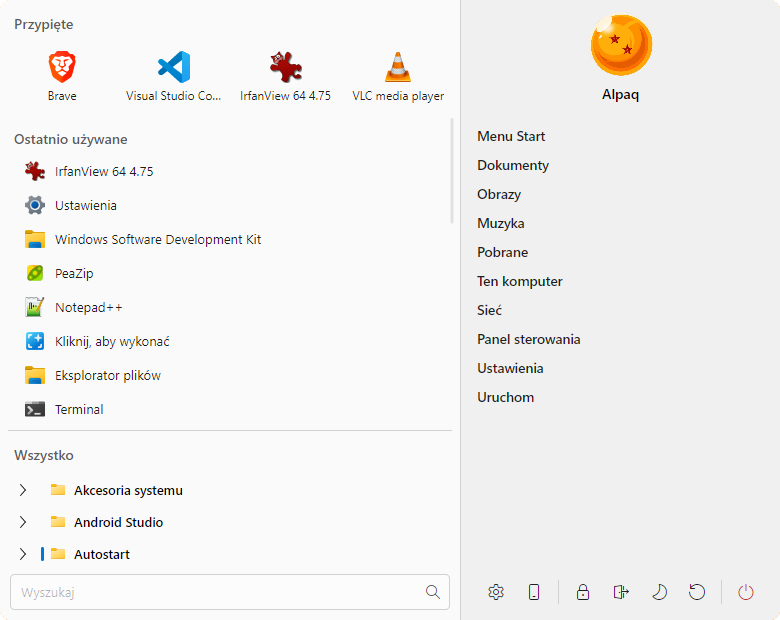](../gallery/win7-light.png) | [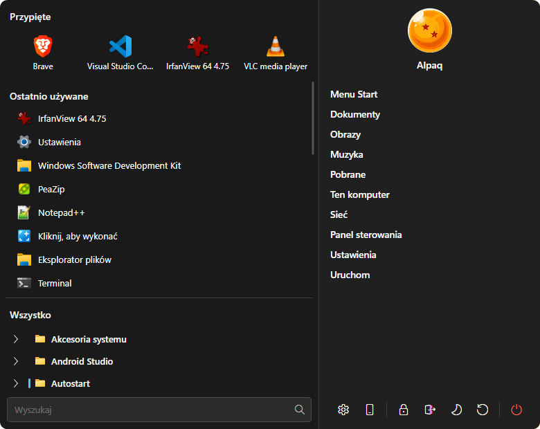](../gallery/win7-dark.png) |
| **Classic XP** &nbsp;·&nbsp; The blue title bar with your avatar, pinned + recent on the left, the shell-shortcut column on the right. | [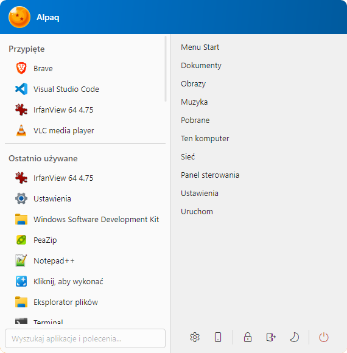](../gallery/xp-light.png) | [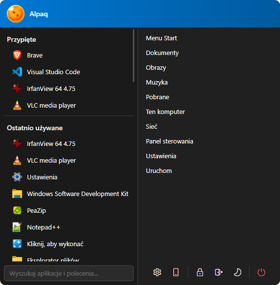](../gallery/xp-dark.png) |
| **Classic 9x** &nbsp;·&nbsp; The compact single column with cascading Programs submenus — Windows 9x / 2000 to the pixel. | [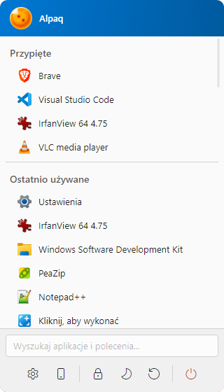](../gallery/9x-light.png) | [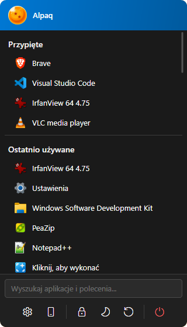](../gallery/9x-dark.png) |
| **Linux Mint Cinnamon** &nbsp;·&nbsp; A dark favorites sidebar (pins, places, power) beside a scrollable content pane. | [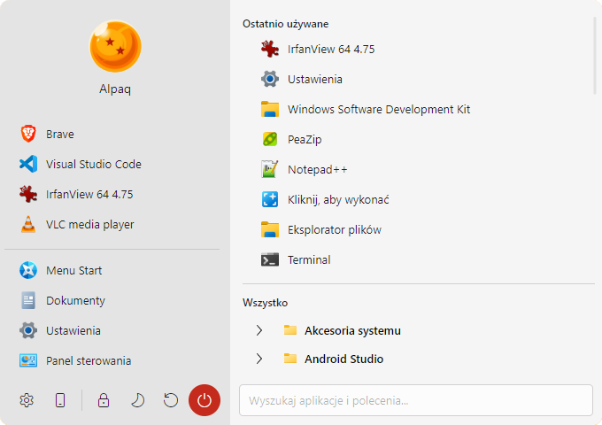](../gallery/mint-light.png) | [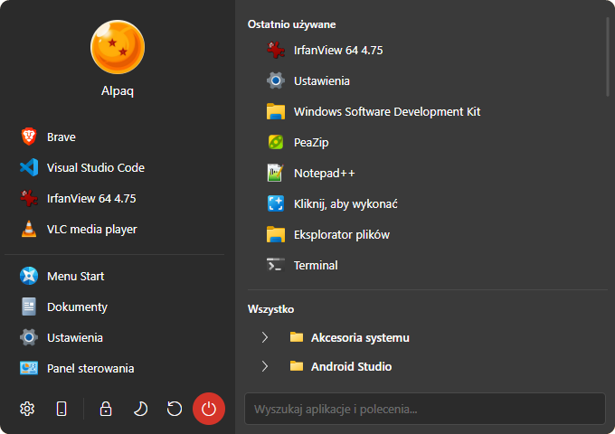](../gallery/mint-dark.png) |
| **Windows 7 Square** &nbsp;·&nbsp; *sample theme — **not** a built-in style.* The Modern layout with every corner squared off, included purely as a worked example of the custom-theme format. | [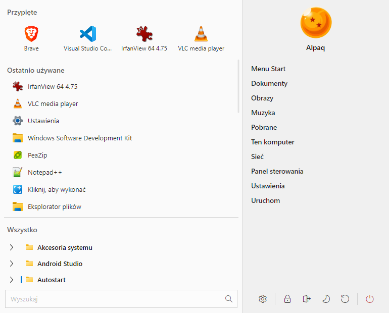](../gallery/sq7-light.png) | [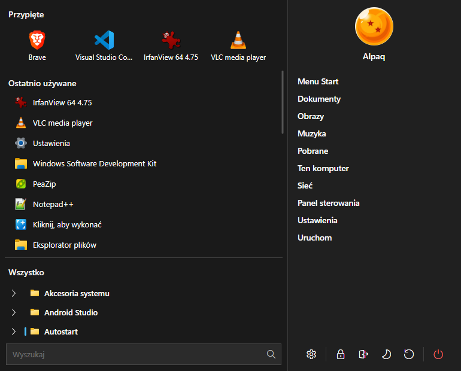](../gallery/sq7-dark.png) |

> The **first five** styles are MenYou's built-in themes — switch between them live in **Settings → Appearance**.
>
> **Windows 7 Square is *not* one of them.** It isn't shipped as a built-in theme and never appears in the Appearance picker — it's a **sample** that shows how to load a custom theme and build your own. The installer drops it beside the app at `samples\custom-themes\Windows7Square.axaml` (also in the repo: [`samples/custom-themes/Windows7Square.axaml`](../samples/custom-themes/Windows7Square.axaml)) so you have a working reference to copy, edit and load from **Settings → Custom**. See [THEMING.md](THEMING.md) to author one from scratch.
